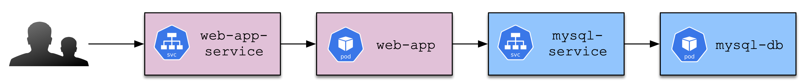

# Exercice 14

<b>Référence Rapide</b>

* Espace de noms : `gemini`, `leo` 
* Documentation : [Dépannage des Applications](https://kubernetes.io/docs/tasks/debug/debug-application/)

Dans cet exercice, vous allez diagnostiquer et résoudre un problème de configuration incorrecte d'une pile d'application. La pile d'application se compose d'une application web implémentée en utilisant node.js et d'une base de données MySQL. L'application web se connecte à la base de données lorsqu'elle demande son point de terminaison. L'application web et la base de données MySQL s'exécutent dans un Pod. Les deux Pods ont été exposés par un Service. Le Service pour le Pod de l'application web est de type `NodePort`. Le Service pour la base de données MySQL est de type `ClusterIP`.

L'image suivante montre l'architecture générale.

## Correction du problème dans l'espace de noms "gemini"

1. Créez un nouvel espace de noms nommé `gemini`.
2. Dans l'espace de noms, créez les objets suivants dans l'ordre indiqué à partir des fichiers YAML : `gemini/mysql-pod.yaml`, `gemini/mysql-service.yaml`, `gemini/web-app-pod.yaml`, `gemini/web-app-service.yaml`.
3. Liste tous les objets et assurez-vous que leur état affiche `Ready`.
4. Le Pod exécutant l'application web expose le port de conteneur 3000. Depuis votre machine, exécutez `curl` ou `wget` pour accéder à l'application via le point de terminaison du Service depuis l'extérieur du cluster. Une réponse réussie devrait afficher `Successfully connected to database!`, une réponse d'échec devrait afficher `Failed to connect to database: <message d'erreur>`.
5. Identifiez le problème sous-jacent et corrigez-le.
6. La commande `curl` ou `wget` devrait maintenant afficher le message `Successfully connected to database!`.
7. Supprimez l'espace de noms `gemini`.

## Correction du problème dans l'espace de noms "leo"

1. Créez un nouvel espace de noms nommé `leo`.
2. Dans l'espace de noms, créez les objets suivants dans l'ordre indiqué à partir des fichiers YAML : `leo/mysql-pod.yaml`, `leo/mysql-service.yaml`, `leo/web-app-pod.yaml`, `leo/web-app-service.yaml`.
3. Liste tous les objets et assurez-vous que leur état affiche `Ready`.
4. Le Pod exécutant l'application web expose le port de conteneur 3000. Depuis votre machine, exécutez `curl` ou `wget` pour accéder à l'application via le point de terminaison du Service depuis l'extérieur du cluster. Une réponse réussie devrait afficher `Successfully connected to database!`, une réponse d'échec devrait afficher `Failed to connect to database: <message d'erreur>`.
5. Identifiez le problème sous-jacent et corrigez-le.
6. La commande `curl` ou `wget` devrait maintenant afficher le message `Successfully connected to database!`.
7. Supprimez l'espace de noms `leo`.